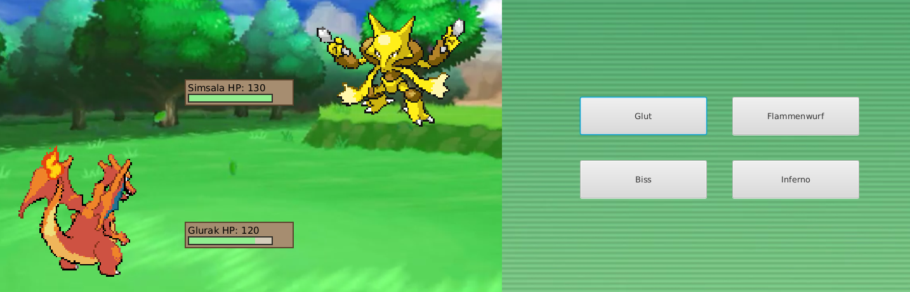

# PokemonLite


[](https://codecov.io/gh/luis-stumpf/PokemonLite)

Welcome to PokemonLite. This game works like the battle phase in a classic Pokemon game

Features:
- TUI
- Animated GUI
- Save Game via XML and JSON
- Undo/Redo




## Run

This project is developed as an exercise for the lecture Software Engineering at HTWG Konstanz. You can compile code with sbt compile, run it with sbt run, and sbt console will start a Scala 3 REPL.

## Docker

- build the project ``` docker build -t pokemonlite/pokemonlite```
- run it with ``` docker run -e DISPLAY=$ip:0 -v /tmp/.X11-unix:/tmp/.X11-unix -it pokemonlite/pokemonlite```
